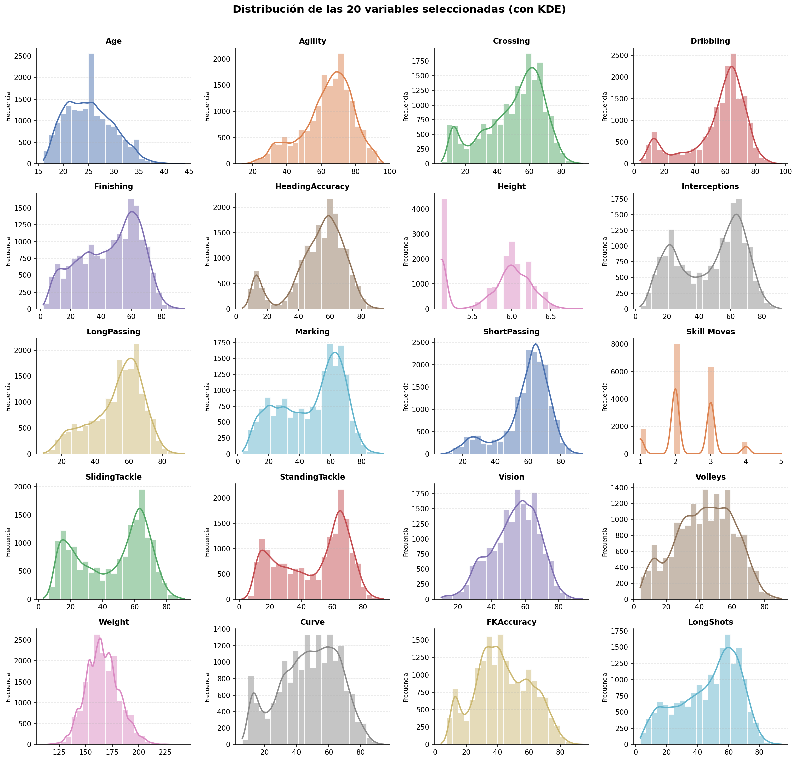
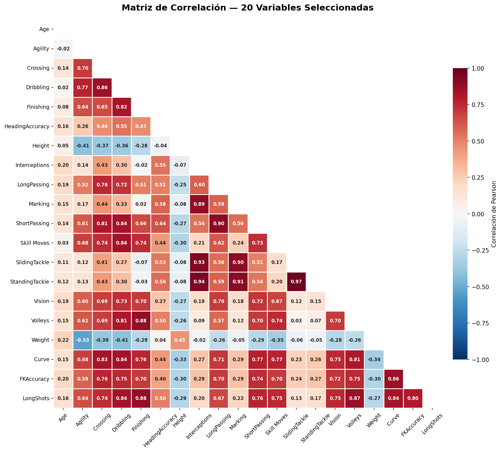
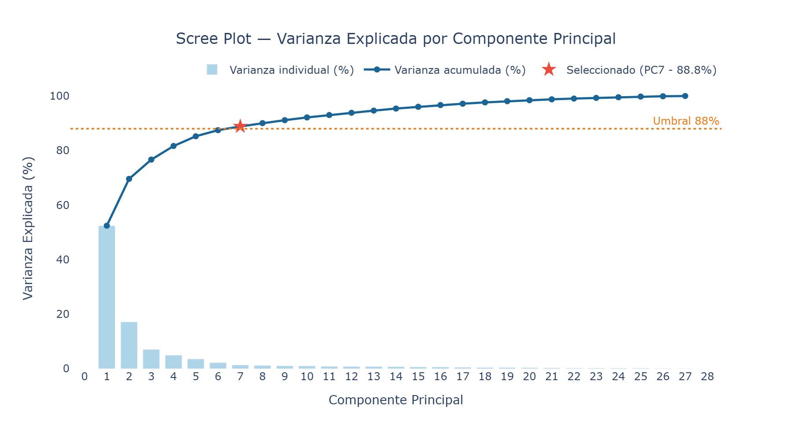
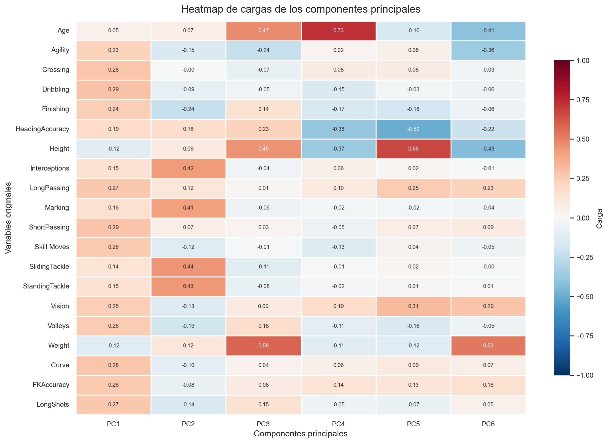
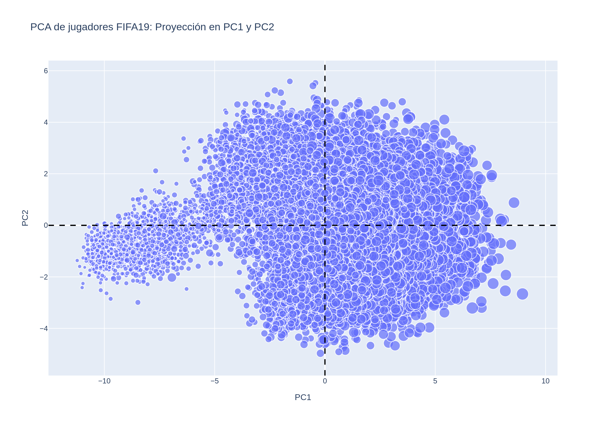
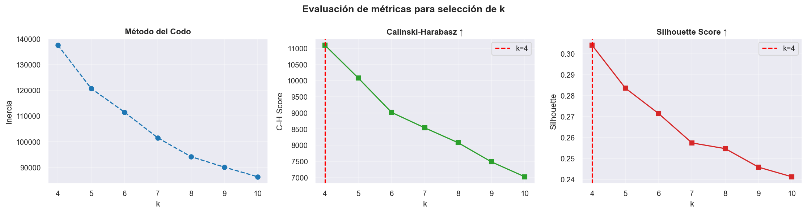
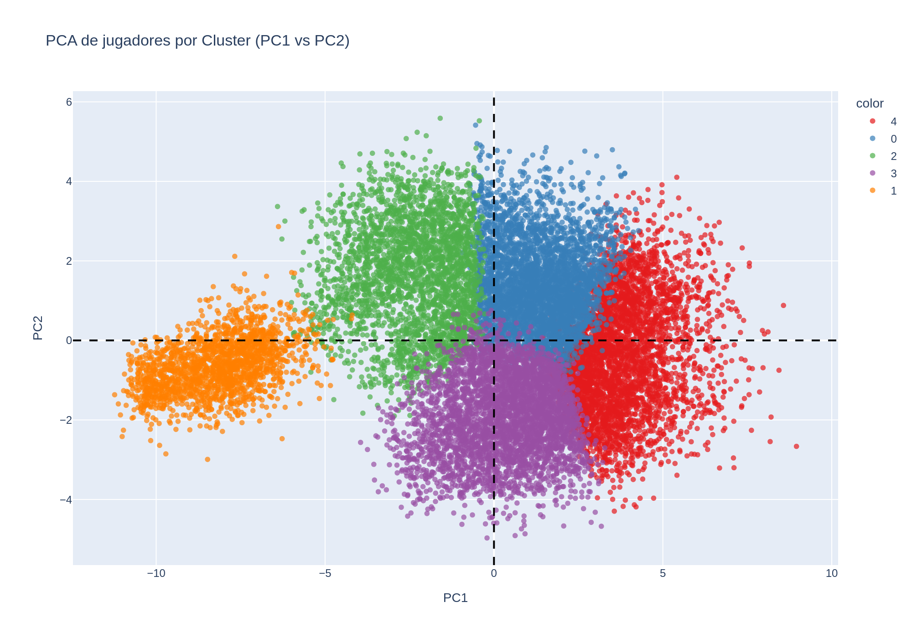
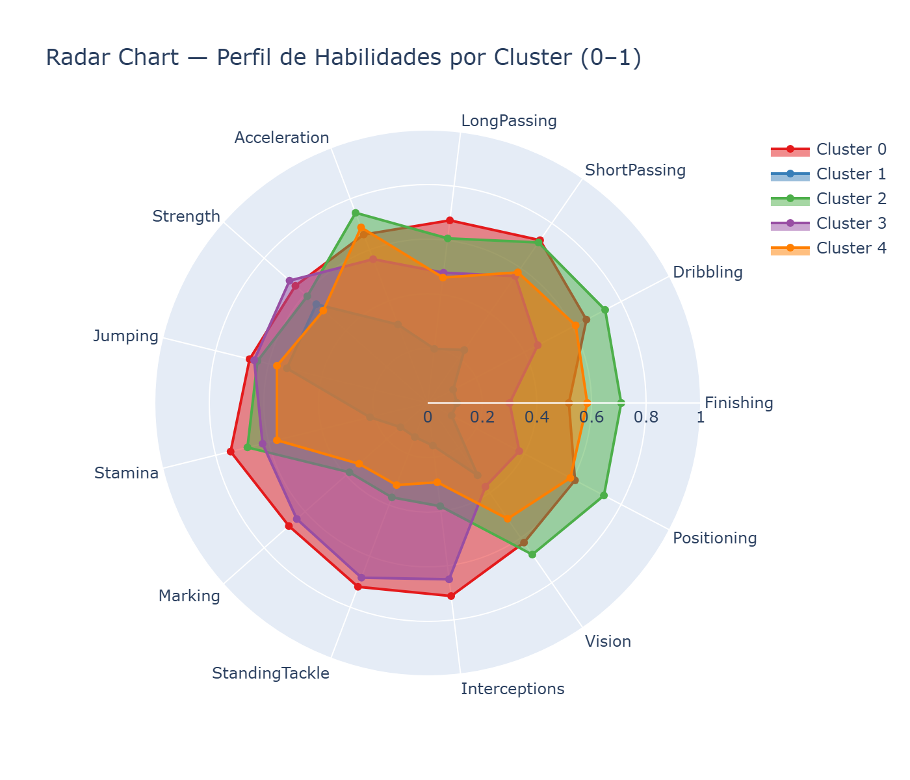

# Segmentación de Jugadores FIFA19
**Diplomado Ciencias de Datos — Generación 33 | Segundo Examen | Abril 2026**

Equipo 5 · Módulo 3

---

## Objetivo

Identificar segmentos de jugadores dentro del dataset FIFA19 que compartan características técnicas y físicas similares, utilizando únicamente habilidades "puras" (excluyendo métricas compuestas como Overall o Potential). El resultado sirve como base para la construcción de equipos ficticios balanceados tácticamente.

---

## Estructura del Proyecto

```
ciencia_datos_m3_e2/
├── Datos/
│   ├── FIFA19-DS.csv          # Dataset principal (17,140 jugadores, 76 atributos)
│   └── FIFA19-MD.csv          # Diccionario de variables
├── images/                    # Figuras generadas por el notebook
├── g33_m3ep2_eq5_notebook.ipynb
├── M3E2.pdf                   # Enunciado del examen
└── README.md
```

---

## Metodología

| Paso | Descripción |
|------|-------------|
| 1. EDA | Exploración de distribuciones, nulos y correlaciones |
| 2. Selección de variables | 27 habilidades puras (sin métricas compuestas ni biométricas estáticas) |
| 3. Reducción dimensional | PCA — 7 componentes → ~88.8% de varianza |
| 4. Clustering | K-Means con k=5, evaluado con Codo + Calinski-Harabasz + Silhouette |
| 5. Perfilamiento | Kruskal-Wallis + Test de Dunn (post-hoc Bonferroni) + Radar Chart |

---

## Variables Seleccionadas (27)

| Grupo | Variables |
|---|---|
| **Técnicas (9)** | Crossing, Finishing, ShortPassing, Volleys, Dribbling, FKAccuracy, LongPassing, BallControl, LongShots |
| **Físicas (9)** | Acceleration, SprintSpeed, Agility, Balance, ShotPower, Jumping, Stamina, Strength, HeadingAccuracy |
| **Mentales/Tácticas (4)** | Reactions, Vision, Positioning, Composure |
| **Defensivas (5)** | Aggression, Interceptions, Marking, StandingTackle, SlidingTackle |

> Se excluyen `Height`, `Weight`, `Age`, `Overall`, `Potential` y `Special` para evitar sesgos de reputación y métricas no tácticas.

---

## Resultados Visuales

### 1. Distribución de Variables

> Histogramas con KDE de las 27 variables seleccionadas. Variables defensivas como `StandingTackle` y `Marking` presentan distribuciones bimodales, anticipando la separación de roles tácticos.

---

### 2. Matriz de Correlación

> Alta multicolinealidad entre grupos técnicos y defensivos, justificando el uso de PCA para reducir redundancia antes del clustering.

---

### 3. Scree Plot — Varianza Explicada por PCA

> Con 7 componentes principales se retiene el ~88.8% de la varianza total. La línea naranja marca el umbral del 88%.

| Componente | Varianza individual | Varianza acumulada |
|---|---|---|
| PC1 | 52.4% | 52.4% |
| PC2 | 17.2% | 69.6% |
| PC3 | 7.1% | 76.7% |
| PC4 | 5.0% | 81.7% |
| PC5 | 3.6% | 85.2% |
| PC6 | 2.2% | 87.5% |
| PC7 | 1.4% | **88.8%** |

---

### 4. Heatmap de Cargas (Loadings)

> PC1 agrupa habilidades técnico-ofensivas (cargas altas en Dribbling, BallControl, ShortPassing); PC2 carga sobre variables defensivas (StandingTackle, Marking, Interceptions); PC3 captura reacciones y condición física.

---

### 5. Proyección PCA (PC1 vs PC2)

> Distribución de los jugadores en el espacio reducido. El tamaño de cada punto refleja `FKAccuracy`.

---

### 6. Métricas de Selección de k

> Calinski-Harabasz (métrica principal) y Silhouette coinciden en **k=4** como óptimo métrico. Se selecciona **k=5** combinando la métrica con el conocimiento de dominio (5 roles tácticos en fútbol).

| k | Inercia | C-H Score | Silhouette |
|---|---|---|---|
| 4 | 137,550.8 | **11,098.0** | **0.3041** |
| 5 | 120,723.0 | 10,080.2 | 0.2836 |
| 6 | 111,493.1 | 9,015.0 | 0.2714 |
| 7 | 101,480.8 | 8,534.9 | 0.2574 |

---

### 7. Clusters en el Espacio PCA

> Visualización de los 5 clusters identificados proyectados sobre PC1 y PC2.

---

### 8. Radar Chart de Habilidades por Cluster

> Perfil normalizado (0–1) de cada cluster en 13 variables clave. Permite comparar visualmente las fortalezas y debilidades de cada arquetipo.

---

## Perfiles Identificados (k=5)

| Cluster | % Jugadores | Perfil Táctico | Fortalezas clave |
|---------|-------------|----------------|-----------------|
| **C0** | 28.5% | Mediocampista Defensivo (CDM) | Interceptions, Marking, StandingTackle, LongPassing |
| **C1** | 10.8% | Portero (GK) | Débil en todas las variables de campo |
| **C2** | 17.9% | Delantero / Atacante (ST/CF) | Finishing, Volleys, Positioning, LongShots |
| **C3** | 22.7% | Defensa Central (CB) | StandingTackle, SlidingTackle, Marking, Strength |
| **C4** | 20.1% | Extremo / Mediocampista Ofensivo (LW/RW/CAM) | Finishing, Acceleration, SprintSpeed, Positioning |

---

## Validación Estadística

- **Kruskal-Wallis**: Las 27 variables discriminan significativamente entre clusters (p<0.05 en todas).
- **Test de Dunn (Bonferroni)**: Todos los pares de clusters son estadísticamente distintos.
- **Silhouette Score final**: 0.2836 · **Calinski-Harabasz final**: 10,080.22

Las variables con mayor poder discriminante son `StandingTackle`, `SlidingTackle` e `Interceptions`, indicando que la dimensión defensiva es el eje principal de diferenciación entre roles.

---

## Reproducibilidad

```python
random_seed = 333
np.random.seed(random_seed)
```

**Dependencias principales:** `pandas` · `numpy` · `scikit-learn` · `matplotlib` · `seaborn` · `plotly` · `kaleido` · `scipy` · `scikit-posthocs`

```bash
pip install pandas numpy scikit-learn matplotlib seaborn plotly kaleido scipy scikit-posthocs
```
