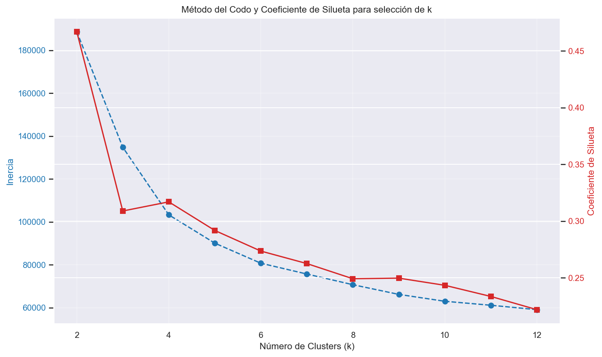
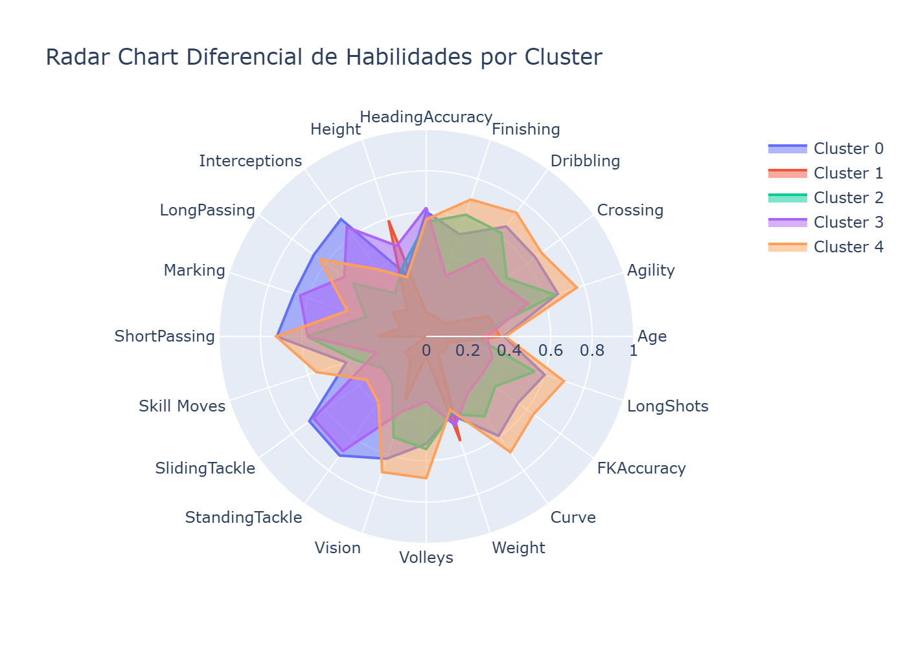

# Segmentación de Jugadores FIFA19
**Diplomado Ciencias de Datos — Generación 33 | Segundo Examen | Abril 2026**

Equipo 5 · Módulo 3

---

## Objetivo

Identificar segmentos de jugadores dentro del dataset FIFA19 que compartan características técnicas y físicas similares, con el fin de descubrir perfiles que permitan construir combinaciones óptimas de jugadores en un equipo ficticio.

---

## Estructura del Proyecto

```
ciencia_datos_m3_e2/
├── datos/
│   ├── FIFA19-DS.csv          # Dataset principal (+17,000 jugadores, 75 atributos)
│   └── FIFA19-MD.csv          # Diccionario de variables
├── images/                    # Figuras generadas por el notebook
├── g33_m3ep2_eq5_notebook.ipynb
├── M3E2.pdf                   # Enunciado del examen
└── README.md
```

---

## Metodología

| Paso | Descripción |
|------|-------------|
| 1. EDA | Exploración de distribuciones, nulos y correlaciones |
| 2. Selección de variables | 20 habilidades puras (sin métricas compuestas) |
| 3. Reducción dimensional | PCA — 6 componentes → ~89.6% de varianza |
| 4. Clustering | K-Means con k=5, evaluado con Elbow + Silhouette |
| 5. Perfilamiento | Z-scores por cluster para identificar arquetipos |

---

## Variables Seleccionadas (20)

`Age` · `Agility` · `Crossing` · `Curve` · `Dribbling` · `FKAccuracy` · `Finishing` · `HeadingAccuracy` · `Height` · `Interceptions` · `LongPassing` · `LongShots` · `Marking` · `ShortPassing` · `Skill Moves` · `SlidingTackle` · `StandingTackle` · `Vision` · `Volleys` · `Weight`

---

## Resultados Visuales

### 1. Distribución de Variables

> Histogramas con KDE de las 20 variables seleccionadas. Variables físicas como `Height` y `Weight` presentan distribución normal; habilidades técnicas como `Finishing` muestran distribuciones bimodales reflejando especialización por posición.

---

### 2. Matriz de Correlación

> Alta multicolinealidad entre grupos de variables técnicas (ofensivas y defensivas), lo que justifica el uso de PCA para reducir redundancia.

---

### 3. Scree Plot — Varianza Explicada por PCA

> Con 6 componentes principales se retiene el ~89.6% de la varianza total. La línea naranja marca el umbral del 88%.

---

### 4. Heatmap de Cargas (Loadings)

> PC1 agrupa habilidades técnico-ofensivas; PC2 carga sobre variables defensivas; PC3 captura atributos físicos (altura y peso).

---

### 5. Proyección PCA (PC1 vs PC2)

> Distribución de los jugadores en el espacio reducido. El tamaño de cada punto refleja `FKAccuracy`.

---

### 6. Método del Codo y Coeficiente de Silueta

> La combinación de ambas métricas indica **k=5** como número óptimo de clusters (Silhouette Score: 0.307).

---

### 7. Clusters en el Espacio PCA

> Visualización de los 5 clusters identificados proyectados sobre PC1 y PC2.

---

### 8. Radar Chart de Habilidades por Cluster

> Perfil normalizado (0–1) de cada cluster. Permite comparar visualmente las fortalezas y debilidades de cada arquetipo.

---

## Perfiles Identificados (k=5)

| Cluster | Arquetipo | Fortalezas | Debilidades |
|---------|-----------|------------|-------------|
| 0 | Defensor clásico | Marking, Tackle, Interceptions | Vision, Finishing |
| 1 | Especialista físico | Height, Weight | Dribbling, Técnica general |
| 2 | Jugador técnico-ofensivo | Skill Moves, Curve, Finishing | Tackle, Marking |
| 3 | Delantero de área | Finishing, Volleys, LongShots | Interceptions, Tackle |
| 4 | Mediocampista completo | Interceptions, Tackle, LongPassing | Físico (Height/Weight) |

---

## Reproducibilidad

```python
random_seed = 333
np.random.seed(random_seed)
```

**Dependencias principales:** `pandas` · `numpy` · `scikit-learn` · `matplotlib` · `seaborn` · `plotly` · `kaleido`

```bash
pip install pandas numpy scikit-learn matplotlib seaborn plotly kaleido
```
